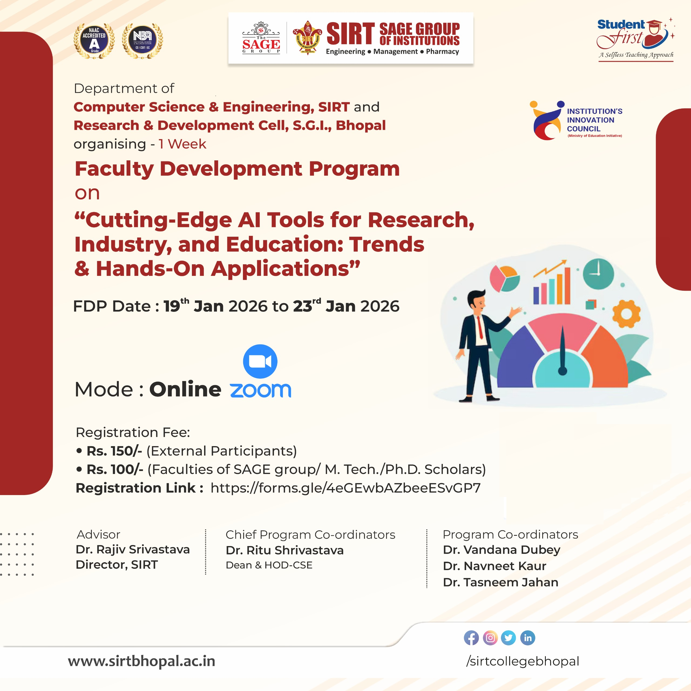
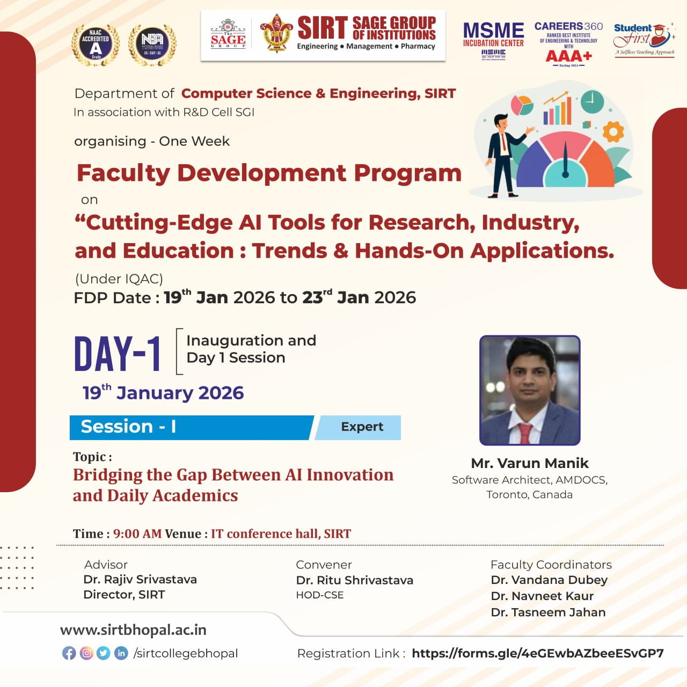
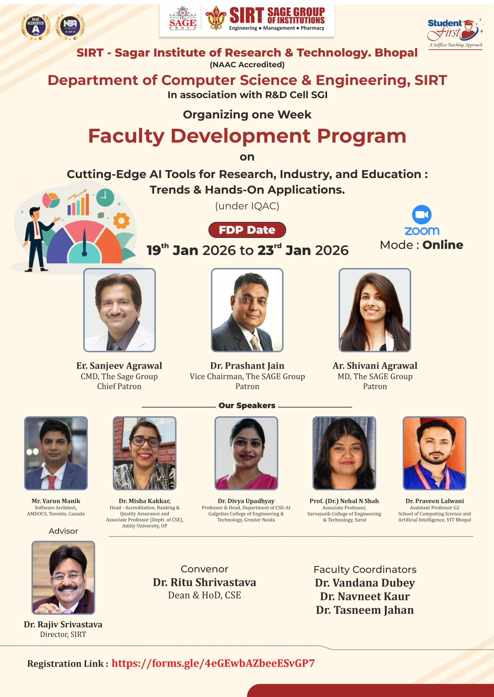

# Amazon Q Workshop 2026 - Faculty Development Program

## 🎯 Workshop Overview
Welcome to the **Amazon Q Workshop 2026** - a focused **Faculty Development Program** designed to introduce educators to AI-powered development assistance and modern cloud technologies.

**Session Facilitator:** **Varun Manik**  
*AWS Ambassador | Cloud Solutions Architect & AI Development Expert | Organizer – AWS User Group Mississauga | X Manager Deloitte | DevOps | DevSecOps | AWS 8X | Cloud Trainer | AI Expert*

### 🎨 Workshop Topic


### 🎨 Workshop Branding


### 📋 Workshop Details & Schedule


### 🏛️ Institution & Program Information  


## 📅 Workshop Program Structure
📋 **[Complete Faculty Development Program Schedule](https://github.com/user-attachments/files/24698014/Daywise.Schedule.of.for.FDP.pdf)**

### 🎓 Session Breakdown

| Session | Topic | Focus Area | Directory |
|---------|-------|------------|-----------|
| **[01 - Introduction](./01-introduction/)** | Amazon Q Overview | Understanding AI-powered development tools | `01-introduction/` |
| **[02 - Setup & Installation](./02-setup-installation/)** | Environment Configuration | CLI Installation & AWS Authentication | `02-setup-installation/` |
| **[03 - Hands-On Demo](./03-hands-on-demo/)** | Live Coding Session | Interactive development with Amazon Q | `03-hands-on-demo/` |
| **[04 - Theory & Architecture](./04-theory/)** | Deep Dive Technical Guide | Backend technology and architecture | `04-theory/` |
| **[05 - Practical Exercise](./05-practical-exercise/)** | Individual Practice | Build real-world projects with AI assistance | `05-practical-exercise/` |
| **[06 - Resources & Next Steps](./06-resources/)** | Wrap-up & Resources | Continued learning and certification paths | `06-resources/` |

### 🎯 Program Objectives
- **Faculty Empowerment**: Equip educators with modern AI development tools
- **Curriculum Enhancement**: Integrate AI-assisted coding in computer science courses  
- **Practical Skills**: Hands-on experience with Amazon Q Developer CLI
- **Industry Alignment**: Bridge academic learning with industry practices
- **Future Readiness**: Prepare students for AI-augmented development careers

## 🚀 What is Amazon Q?
Amazon Q is AWS's revolutionary AI-powered assistant that transforms how developers work:

### Core Capabilities:
- **🤖 Intelligent Code Generation** - Write, debug, and optimize code with AI assistance
- **☁️ AWS Service Integration** - Seamlessly work with 200+ AWS services
- **🏗️ Infrastructure Automation** - Automate infrastructure tasks and deployments
- **📚 Documentation & Explanations** - Generate comprehensive documentation automatically
- **🔍 Code Analysis & Security** - Identify vulnerabilities and suggest improvements

## 🎓 Learning Objectives
By the end of this workshop, participants will be able to:
- ✅ Leverage Amazon Q for accelerated development workflows
- ✅ Integrate AI assistance into daily coding practices
- ✅ Automate AWS infrastructure management with Q
- ✅ Implement best practices for AI-assisted development
- ✅ Train students using modern AI development tools

## 🛠️ Prerequisites

### Technical Requirements:
- **AWS Account** with appropriate permissions
- **Amazon Q CLI** installed
- **Basic familiarity** with AWS services
- **Development environment** (VS Code recommended)
- **Git** for version control

### Knowledge Prerequisites:
- Basic programming knowledge (Python/JavaScript preferred)
- Understanding of cloud computing concepts
- Familiarity with command-line interfaces

## 🚀 Quick Start Guide

### 1. Environment Setup
```bash
# Clone this repository
git clone https://github.com/manikcloud/amazon-q-workshop-2026.git
cd amazon-q-workshop-2026

# Install Amazon Q CLI
curl -sSL https://d2yblsmsllhwdu.cloudfront.net/q/install.sh | sh

# Configure AWS credentials
aws configure
```

### 2. Verify Installation
```bash
# Check Q CLI version
q --version

# Test authentication
q auth status
```

## 🎯 Hands-On Exercises

### 📁 **Complete Workshop Structure:**
```
amazon-q-workshop-2026/
├── 📚 01-introduction/              # Amazon Q Overview & Concepts
├── ⚙️ 02-setup-installation/        # CLI Installation & Configuration  
├── 💻 03-hands-on-demo/             # Live Coding & Interactive Sessions
│   ├── event-website/              # SIRT University Event Website
│   ├── python-calculator/          # Web-based Calculator App
│   └── cs-department-website/      # Department Website Demo
├── 📖 04-theory/                    # Deep Dive Technical Architecture
│   └── amazon-q-deep-dive-guide.md # Comprehensive Technical Guide
├── 🛠️ 05-practical-exercise/       # Individual Practice Projects
│   └── student-database/           # Student Management System
├── 📚 06-resources/                 # Additional Learning Materials
└── 🖼️ images/                      # Workshop Images & Assets
    ├── jan-2026-fdp-creative.png   # Event Branding
    ├── workshop-schedule.png       # Schedule Details
    └── institution-details.png     # SIRT Institution Info
```

**🛠️ [Complete Exercise Guide](./exercises/)**

### Exercise Categories:
- **🟢 Beginner:** Code Generation, AWS CLI, Basic Debugging
- **🟡 Intermediate:** Infrastructure as Code, API Development, Security Analysis  
- **🔴 Advanced:** Full-Stack Applications, CI/CD Pipelines, Multi-Service Architecture

**📝 [View All Exercises](./exercises/) | 💡 [Exercise Solutions](./solutions/)**

## 📖 Resources & References

### Official Documentation:
- 📘 [Amazon Q Developer Guide](https://docs.aws.amazon.com/amazonq/)
- 📗 [AWS CLI Documentation](https://docs.aws.amazon.com/cli/)
- 📙 [AWS Best Practices](https://aws.amazon.com/architecture/well-architected/)

### Additional Learning:
- 🎥 **[Workshop Video Recordings](./videos/)** - Complete session recordings
- 📊 **[Presentation Slides](./slides/)** - All workshop presentations
- 💻 **[Code Examples](./examples/)** - Ready-to-use code templates
- 📝 **[Exercise Solutions](./solutions/)** - Complete exercise answers
- 📚 **[Additional Resources](./resources/)** - Extended learning materials

## 👨‍🏫 About the Facilitator

**Varun Manik** - AWS Ambassador | Amdocs | Organizer – AWS User Group Mississauga | X Manager Deloitte

### Professional Expertise:
- **AWS 8X Certified** Cloud Solutions Architect
- **DevOps & DevSecOps** Implementation Expert  
- **AI/ML Development** and Integration Specialist
- **Cloud Trainer** with extensive teaching experience
- **AWS Ambassador** and Community Leader

### Leadership & Community:
- **AWS User Group Mississauga** - Organizer
- **Former Manager** at Deloitte
- **Current Role** at Amdocs
- **Active Contributor** to cloud and AI communities

## 📞 Contact & Support

**Workshop Facilitator:** Varun Manik  

### Connect with Varun:
- 📧 **Email:** varunmanik1@gmail.com
- 💼 **LinkedIn:** https://www.linkedin.com/in/vkmanik/
- 🐙 **GitHub:** https://github.com/manikcloud
- 📝 **Medium:** https://varunmanik1.medium.com/
- 📺 **YouTube:** https://bit.ly/32fknRN
- 🐦 **Twitter:** https://twitter.com/varunkmanik
- 📘 **Facebook:** https://www.facebook.com/cloudvirtualization/

### Workshop Support:
For technical issues or questions:
1. **Email directly:** varunmanik1@gmail.com
2. **Create an issue** in this repository
3. **Connect on LinkedIn** for professional networking
4. **Join live Q&A** sessions during the workshop

---

**🚀 Ready to transform your development workflow with AI? Let's get started!**

*Amazon Q Workshop 2026 - Empowering Educators with AI-Powered Development*
