# Amazon Q CLI - Deep Dive Technical Guide

## 1. HISTORY & EVOLUTION OF AMAZON Q

### **Timeline:**
- **2023**: Amazon Q announced at AWS re:Invent
- **2024**: General availability with IDE integrations
- **2025**: Enhanced CLI capabilities and multi-language support
- **2026**: Advanced AI reasoning and code generation

### **Evolution Phases:**
1. **Phase 1**: Basic code completion and suggestions
2. **Phase 2**: Conversational AI for development tasks
3. **Phase 3**: Full-stack application generation
4. **Phase 4**: Intelligent debugging and optimization

### **Market Context:**
- Response to GitHub Copilot and ChatGPT Code Interpreter
- AWS's entry into AI-powered development tools
- Integration with existing AWS ecosystem

---

## 2. HOW AMAZON Q CLI WORKS

### **High-Level Architecture:**
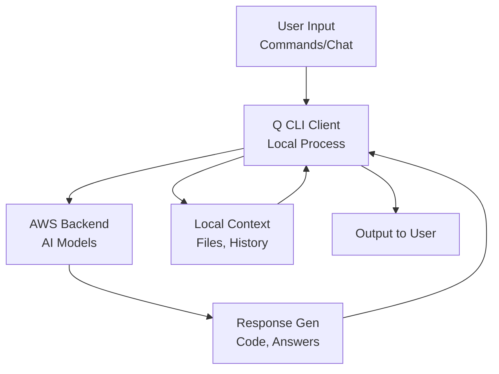

### **Request Flow:**
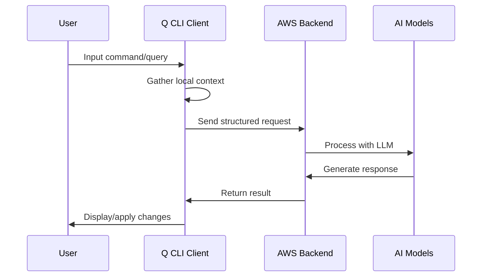

---

## 3. BACKEND TECHNOLOGY STACK

### **Core Technologies:**

#### **AI/ML Stack:**
- **Foundation Models**: Amazon Titan, Claude (Anthropic)
- **Model Training**: Custom AWS infrastructure
- **Inference**: Amazon Bedrock runtime
- **Context Processing**: Transformer-based architectures

#### **Infrastructure:**
- **Compute**: AWS Graviton processors
- **Storage**: Amazon S3 for model artifacts
- **Networking**: AWS Global Infrastructure
- **Caching**: ElastiCache for response optimization

#### **Security Layer:**
- **Authentication**: AWS IAM and Builder ID
- **Encryption**: TLS 1.3 in transit, AES-256 at rest
- **Access Control**: Fine-grained permissions
- **Audit**: CloudTrail integration

#### **API Gateway:**
- **Load Balancing**: Application Load Balancer
- **Rate Limiting**: API Gateway throttling
- **Monitoring**: CloudWatch metrics
- **Scaling**: Auto Scaling Groups

---

## 4. ARCHITECTURE DEEP DIVE

### **Multi-Tenant Architecture:**
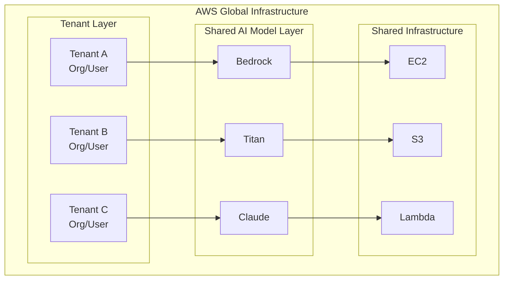

### **Data Isolation:**
- **Logical Separation**: Tenant-specific data partitioning
- **Encryption Keys**: Per-tenant encryption keys
- **Access Policies**: IAM-based tenant isolation
- **Network Isolation**: VPC and security group separation

---

## 5. HOW AMAZON Q DIFFERS FROM OTHER AI TOOLS

### **Comparison Table:**

| Feature | Amazon Q | GitHub Copilot | ChatGPT | Cursor |
|---------|----------|----------------|---------|---------|
| **AWS Integration** | ✅ Native | ❌ None | ❌ None | ❌ Limited |
| **CLI Interface** | ✅ Full CLI | ❌ IDE Only | ❌ Web Only | ✅ Editor |
| **Context Awareness** | ✅ AWS Resources | ✅ Code Only | ❌ Limited | ✅ Project |
| **Security Model** | ✅ Enterprise | ✅ Good | ❌ Basic | ✅ Good |
| **Code Generation** | ✅ Full Apps | ✅ Snippets | ✅ Functions | ✅ Files |
| **Infrastructure** | ✅ IaC Support | ❌ None | ❌ Limited | ❌ None |
| **Debugging** | ✅ AWS Logs | ✅ Code Issues | ✅ General | ✅ Runtime |
| **Pricing Model** | ✅ Usage-based | ✅ Subscription | ✅ Subscription | ✅ Subscription |

### **Unique Advantages:**
- **AWS Ecosystem Integration**: Direct access to AWS services
- **Infrastructure as Code**: CloudFormation, CDK, Terraform support
- **Security-First**: Enterprise-grade security and compliance
- **Context-Aware**: Understands AWS resources and configurations

---

## 6. TECHNICAL CONCEPTS TO EXPLAIN

### **A. Prompt Engineering (How Q Understands You):**

#### **Context Window Management:**
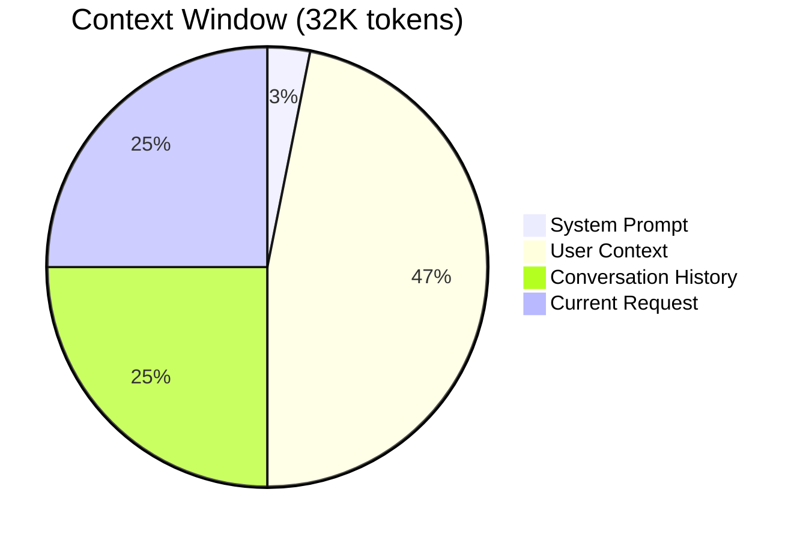

#### **Context Components:**
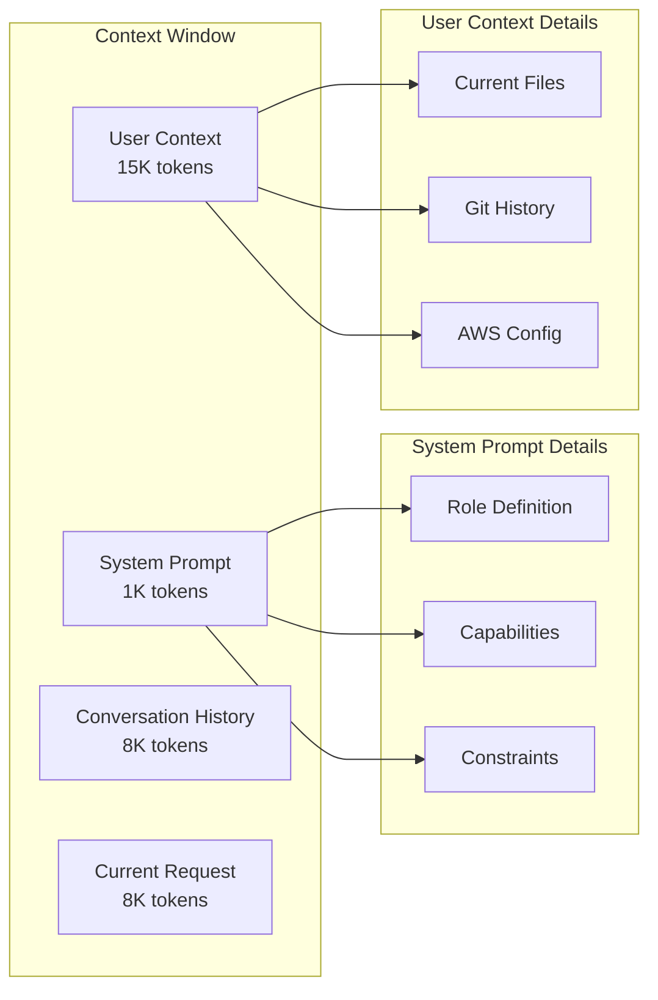

#### **Prompt Structure:**
1. **System Context**: Role, capabilities, constraints
2. **Environmental Context**: Files, configs, AWS resources
3. **Historical Context**: Previous interactions and changes
4. **Current Request**: Specific user input and requirements

### **B. Code Understanding Pipeline:**
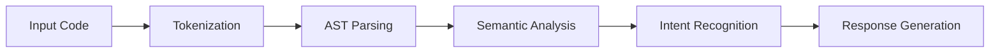

### **C. Multi-Modal Processing:**
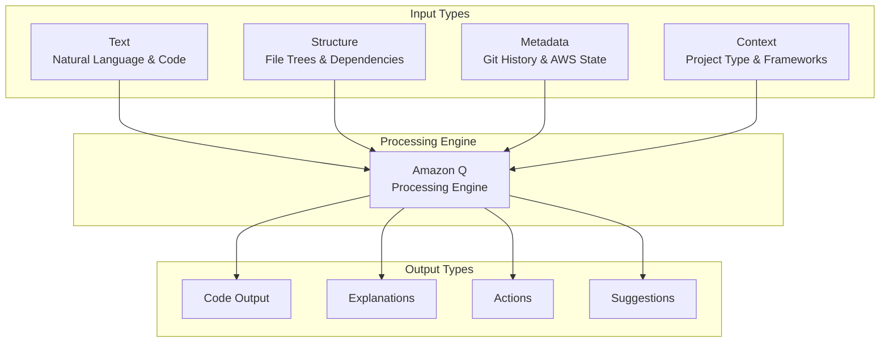

---

## 7. SECURITY & PRIVACY ARCHITECTURE

### **Data Flow & Encryption:**
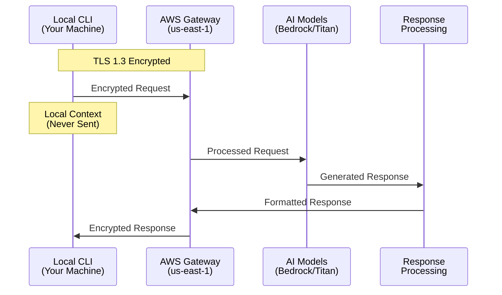

### **Security Architecture:**
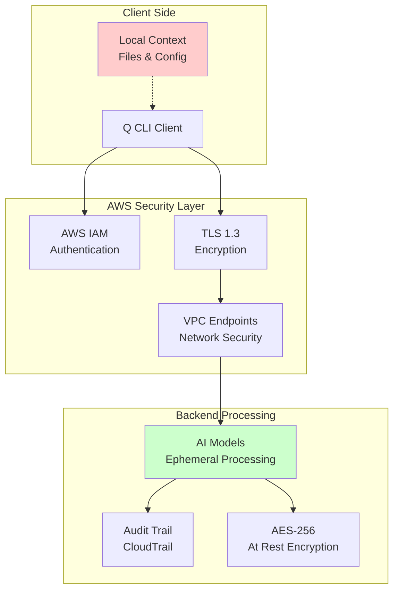

### **Privacy Guarantees:**
- **No Code Storage**: Your code is not stored by AWS
- **Ephemeral Processing**: Requests processed and discarded
- **Tenant Isolation**: Your data never mixed with others
- **Audit Trails**: All interactions logged for compliance

### **Security Controls:**
- **Authentication**: AWS Builder ID or IAM credentials
- **Authorization**: Fine-grained permissions per user/org
- **Network Security**: VPC endpoints, security groups
- **Data Classification**: Automatic PII detection and handling

---

## 8. PERFORMANCE & SCALABILITY

### **Response Times:**
- **Simple Queries**: < 2 seconds
- **Code Generation**: 3-8 seconds
- **Complex Analysis**: 10-30 seconds
- **Large File Processing**: 30-60 seconds

### **Scalability Metrics:**
- **Concurrent Users**: Millions globally
- **Requests/Second**: 100K+ peak capacity
- **Model Inference**: Auto-scaling based on demand
- **Geographic Distribution**: 25+ AWS regions

---

## 9. INTEGRATION ECOSYSTEM

### **Integration Architecture:**
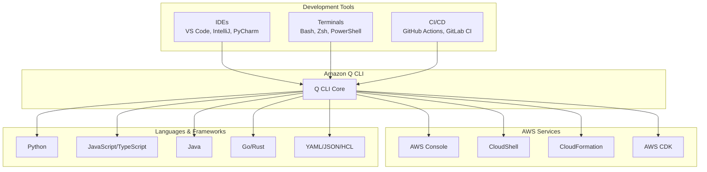

### **Development Tools:**
- **IDEs**: VS Code, IntelliJ, PyCharm
- **Terminals**: Bash, Zsh, PowerShell, Fish
- **CI/CD**: GitHub Actions, GitLab CI, Jenkins
- **Cloud**: AWS Console, CloudShell

### **Language Support:**
- **Primary**: Python, JavaScript, TypeScript, Java
- **Secondary**: Go, Rust, C#, PHP, Ruby
- **Infrastructure**: YAML, JSON, HCL (Terraform)
- **Markup**: HTML, CSS, Markdown

---

### **Future Roadmap Visualization:**
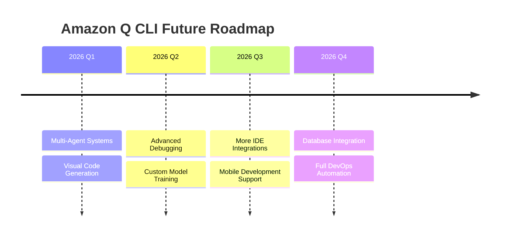

### **Technology Evolution:**
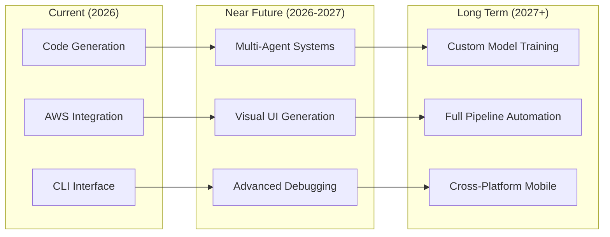

---

**This comprehensive guide covers the technical depth needed for your Amazon Q CLI session, from foundational concepts to advanced architecture details.**
